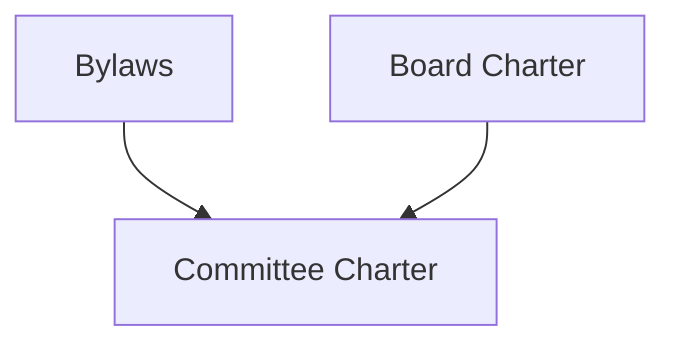

# `source/site.yml` Examples

`source/site.yml` is for project-level settings and optional page overrides.
Markdown documents are auto-discovered recursively under `source/`, so most
projects do not need to list every document here.

## When To Use `site.yml`

Use `source/site.yml` for project-wide settings and build-time choices:

- project title, subtitle, and author
- page order in generated indexes, PDF, and DOCX exports
- metadata overrides for specific files
- centralized metadata, if your team prefers one metadata file
- compatibility with older projects that already use `pages:`

Use the Markdown source file for changes that belong to the document:

- body content
- headings and references
- frontmatter that should stay with the document when it is moved or reused
- document-specific values such as `document-id`, `version`, `status`, `type`, `tags`, review dates, and `changes`

The simplest workflow is to keep document metadata in Markdown frontmatter and
use `source/site.yml` only for project metadata and ordering exceptions.

## What Override Means

An override is a value in `source/site.yml` that replaces the same value from a
Markdown file's YAML frontmatter for one listed document.

The generator finds the document by `pages[].file`, then merges metadata in this
order:

1. Read YAML frontmatter from the Markdown file.
2. Read that file's matching entry in `source/site.yml`.
3. Use `source/site.yml` values when the same key exists in both places.

For example, this Markdown frontmatter:

```yaml
---
document-id: "DOC-GOV-0001"
title: "Old Board Policy"
status: "draft"
version: "1.0.0"
last-reviewed: "2026-01-01"
---
```

with this `source/site.yml` entry:

```yaml
pages:
  - file: "policies/board-governance.md"
    title: "Board Governance Policy"
    status: "approved"
    last-reviewed: "2026-06-25"
```

builds as:

```yaml
document-id: "DOC-GOV-0001"
title: "Board Governance Policy"
status: "approved"
version: "1.0.0"
last-reviewed: "2026-06-25"
```

`title`, `status`, and `last-reviewed` came from `source/site.yml`. `version`
and `document-id` stayed from the Markdown file because they were not overridden.

## Project Metadata Only

Use this when all document metadata lives in Markdown frontmatter.

```yaml
# Used on the generated Obsidian index, PDF title page, and DOCX title page.
title: "Board Governance Manual"
subtitle: "Policies, procedures, decisions, and supporting records."
author: "Governance Committee"
```

## Permanent Document IDs

Every document should have a stable `document-id` in its Markdown frontmatter.
Keep this value the same when the document title, filename, folder, or generated
`slug` changes.

```yaml
---
document-id: "DOC-GOV-0042"
title: "Board Governance Policy"
version: "1.0.0"
status: "approved"
type: "policy"
document-category: "governance"
effective-date: "2026-06-25"
last-reviewed: "2026-06-25"
tags: ["governance", "board", "policy"]
---
```

Use `document-id` for the document itself. Use `decision-id` only when the
document records a governance decision.

## Force Page Order

Use `pages:` when you want specific documents to appear first in the generated
index, PDF, and DOCX exports. Any other Markdown files are still discovered and
appended after the listed files.

```yaml
title: "Board Governance Manual"
subtitle: "Policies, procedures, decisions, and supporting records."
author: "Governance Committee"

pages:
  - file: "policies/board-governance.md"
  - file: "procedures/document-control.md"
  - file: "decisions/annual-approval.md"
```

## Override One Document

Use this when a document has frontmatter, but you want the build configuration
to override selected fields.

```yaml
title: "Board Governance Manual"
subtitle: "Policies, procedures, decisions, and supporting records."
author: "Governance Committee"

pages:
  - file: "policies/board-governance.md"
    document-id: "DOC-GOV-0001"
    title: "Board Governance Policy"
    status: "approved"
    version: "1.1.0"
    last-reviewed: "2026-06-25"
    slug: "01 Board Governance Policy"
```

The `file` value points to the Markdown source file. The `slug` value controls
the generated Obsidian filename while preserving the source folder path.

## Backward-Compatible `source/pages/` Files

Older projects can keep using bare filenames. A bare filename is resolved
relative to `source/pages/`.

```yaml
title: "Generator Starter Kit"
subtitle: "A reusable Python pipeline for Markdown, Obsidian, PDF, and DOCX."
author: "Codex"

pages:
  - file: "overview.md"
    slug: "01 Governance Document Standard"
  - file: "workflow.md"
    slug: "02 Documentation Build Workflow"
  - file: "publishing.md"
    slug: "03 Publishing Outputs Policy"
```

This resolves to:

- `source/pages/overview.md`
- `source/pages/workflow.md`
- `source/pages/publishing.md`

## Full Document Metadata In `site.yml`

This style is useful if you want all document metadata in one file. Markdown
frontmatter still works, and values here take precedence for listed pages.

```yaml
title: "Board Governance Manual"
subtitle: "Policies, procedures, decisions, and supporting records."
author: "Governance Committee"

pages:
  - file: "policies/board-governance.md"
    document-id: "DOC-GOV-0001"
    title: "Board Governance Policy"
    version: "1.0.0"
    status: "approved"
    type: "policy"
    document-category: "governance"
    effective-date: "2026-06-25"
    last-reviewed: "2026-06-25"
    tags: ["governance", "board", "policy"]
    author: "Governance Committee"
    next-review-date: "2027-06-25"
    review-cycle: "annual"
    approved-by: "Board of Directors"
    authority-level: "board"
    related-documents: ["[[Document Control Procedure]]"]
    slug: "01 Board Governance Policy"
```

## Nested Folder Example

Nested folder paths are resolved relative to `source/`, and the generated vault
keeps that folder structure.

```yaml
title: "Operations Manual"
subtitle: "Operational policies and procedures."
author: "Operations Lead"

pages:
  - file: "governance/policies/authority-policy.md"
    slug: "Authority Policy"
  - file: "operations/procedures/intake-workflow.md"
    slug: "Intake Workflow"
```

Generated Obsidian paths:

- `dist/vault/governance/policies/Authority Policy.md`
- `dist/vault/operations/procedures/Intake Workflow.md`

## Decision Register Metadata

Add `decision-id` to any document that should appear in
`Decision Register.md`.

```yaml
---
document-id: "DOC-GOV-0042"
title: "Board Budget Approval"
version: "1.0.0"
status: "approved"
type: "decision"
document-category: "governance"
effective-date: "2026-06-25"
last-reviewed: "2026-06-25"
tags: ["governance", "decision"]
owner: "Board Secretary"
decision-id: "GOV-0042"
approved-by: "Board of Directors"
authority-level: "board"
---
```

## Dependency Map Metadata

Add `dependencies` when one document depends on another. The generator builds
`Dependency Map.md` and a Mermaid graph automatically.

```yaml
---
document-id: "DOC-GOV-0100"
title: "Committee Charter"
version: "1.0.0"
status: "approved"
type: "charter"
document-category: "governance"
effective-date: "2026-06-25"
last-reviewed: "2026-06-25"
tags: ["governance", "committee"]
owner: "Governance Committee"
dependencies:
  - "[[Bylaws]]"
  - "[[Board Charter]]"
---
```

The generated Mermaid direction is dependency first, dependent document second:



## Changelog Metadata

Add `changes` to a document when you want `Changelog.md` to include a clear
human-readable change history. Without `changes`, the generator still adds a
fallback changelog entry from `version`, `status`, and `last-reviewed`.

Rich entries can include `date`, `version`, `status`, and `summary`:

```yaml
---
document-id: "DOC-GOV-0100"
title: "Committee Charter"
version: "1.1.0"
status: "approved"
type: "charter"
document-category: "governance"
effective-date: "2026-06-25"
last-reviewed: "2026-06-25"
tags: ["governance", "committee"]
changes:
  - date: "2026-06-25"
    version: "1.1.0"
    status: "approved"
    summary: "Added membership terms and annual reporting requirements."
  - date: "2026-04-10"
    version: "1.0.0"
    summary: "Initial approved charter."
---
```

Simple entries are also valid:

```yaml
changes:
  - "Clarified review cycle."
  - "Updated related document links."
```

## Common Mistakes

- Do not put generated `dist/vault/` paths in `file`; use paths under `source/`.
- Do not list every Markdown file unless you need custom ordering or overrides.
- If you rename a source file, update or remove its matching `pages[].file`.
- If a required frontmatter field is missing from both Markdown and `site.yml`,
  the build raises an error.
